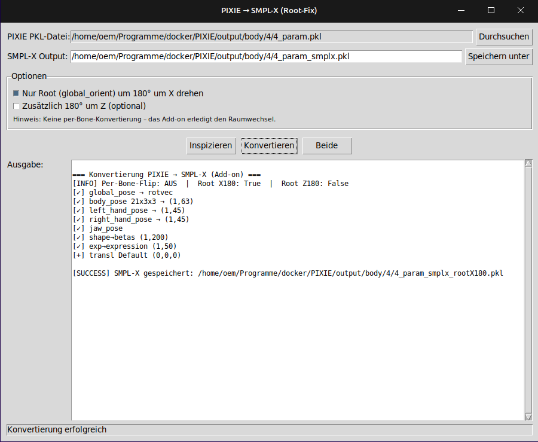

# PIXIE to SMPL-X Converter

A GUI tool for converting PIXIE parameters into the standard SMPL-X format for Blender and other 3D applications.

## 🎯 Overview

This tool converts PIXIE `*_param.pkl` files into standard SMPL-X `.pkl` files that can be used directly with the Blender SMPL-X add-on. The converter fixes the well-known PIXIE “headstand” orientation by applying an intelligent root rotation.
<p align="center">
  
</p>

### ✨ Features

* **GUI interface** for easy use
* **Smart format detection** (rotation matrices vs. axis-angle)
* **Root-fix option** to correct PIXIE orientation issues
* **Automatic key mapping** (`shape`→`betas`, `exp`→`expression`)
* **Blender-optimized output** with convenient file names
* **Detailed inspection logs** for debugging

## 📋 Requirements

### Python packages

```bash
pip install numpy scipy tkinter pickle
```

**Optional for extended analysis:**

```bash
pip install mathutils
```

### System requirements

* **Python 3.7+**
* **tkinter** (usually preinstalled)
* **scipy** for rotation conversions
* **numpy** for array operations

## 📦 Installation

1. **Clone the repository:**

   ```bash
   git clone https://github.com/Painter3000/pixie-to-smplx-converter.git
   cd pixie-to-smplx-converter
   ```

2. **Install dependencies:**

   ```bash
   pip install -r requirements.txt
   ```

3. **Start the GUI:**

   ```bash
   python PIXIE_to_SMPL-X_Converter_GUI_rootfix.py
   ```

## 🎮 Usage

### 1. Convert PIXIE data

1. **Start the GUI** and select a PIXIE `.pkl` file
2. The **output path** is generated automatically
3. Configure **Root-Fix options**:

   * ✅ **“180° around X”**: fixes headstand (recommended)
   * ⭕ **“180° around Z”**: for special PIXIE variants
4. Click **“Both”** to Inspect + Convert

### 2. Import into Blender

1. Install the **Blender SMPL-X add-on** ([link](#blender-smpl-x-add-on))
2. Load a **SMPL-X mesh** into the scene
3. **Import PKL**: `File → Import → SMPL-X Parameters (.pkl)`
4. Select the **converted file** (e.g., `*_rootX180.pkl`)

## 🔧 Blender SMPL-X Add-on

### Installation

1. **Download the add-on:**

   * [SMPL-X Blender Add-on](https://smpl-x.is.tue.mpg.de/) (official)
   * Or: [GitHub alternative](https://github.com/Meshcapade/SMPL_blender_addon)

2. **Install in Blender:**

   ```
   Edit → Preferences → Add-ons → Install...
   → choose smplx_blender_addon.zip → Enable
   ```

3. **Download SMPL-X models:**

   * [SMPL-X Models](https://smpl-x.is.tue.mpg.de/download.php)
   * Registration required
   * Copy models to the add-on’s path

### Compatibility

| Add-on Version | Blender Version | Status   |
| -------------- | --------------- | -------- |
| 1.0.x          | 3.0 – 3.6       | ✅ Tested |
| 2.0.x          | 4.0+            | ✅ Tested |

## 📊 Format Details

### Input format (PIXIE)

```python
{
    'global_pose': (1, 3, 3),      # rotation matrix
    'body_pose': (21, 3, 3),       # 21 joints as 3x3 matrices
    'left_hand_pose': (15, 3, 3),  # hand joints as matrices
    'right_hand_pose': (15, 3, 3),
    'jaw_pose': (1, 3, 3),
    'shape': (200,),               # shape parameters
    'exp': (50,),                  # expressions
    # + other PIXIE-specific keys
}
```

### Output format (SMPL-X)

```python
{
    'global_orient': (1, 3),       # axis–angle vector
    'body_pose': (1, 63),          # 21*3 = 63 axis–angle values
    'left_hand_pose': (1, 45),     # 15*3 = 45 values
    'right_hand_pose': (1, 45),
    'jaw_pose': (1, 3),
    'betas': (1, 10/200),          # shape parameters
    'expression': (1, 50),         # facial expressions
    'transl': (1, 3),              # translation
}
```

## 🔄 Root-Fix Explanation

### Problem

PIXIE and Blender use different coordinate systems:

* **PIXIE**: Y-up, figure often “upside down”
* **Blender**: Z-up, standard orientation

### Solution

The **Root-Fix** rotates only `global_orient` by 180° around the X-axis:

```python
# Root rotation only; local joint poses remain unchanged
R_blender = RotX(180°) * R_pixie_root
```

**Benefits:**

* ✅ Fixes the orientation issue
* ✅ Preserves local joint relationships exactly
* ✅ No pose artifacts
* ✅ Fast and numerically stable

## 📁 File-name Conventions

| File name                          | Description                 |
| ---------------------------------- | --------------------------- |
| `original.pkl`                     | Original PIXIE file         |
| `original_smplx.pkl`               | Standard SMPL-X (no fix)    |
| `original_smplx_rootX180.pkl`      | With root fix (for Blender) |
| `original_smplx_rootX180_Z180.pkl` | With X+Z rotation           |

## 🐛 Troubleshooting

### Common issues

**1. “ModuleNotFoundError: No module named 'mathutils'”**

```bash
pip install mathutils
# Or use the GUI without mathutils (still works)
```

**2. “Figure is still upside down”**

* ✅ Enable Root-Fix: “180° around X”
* Check Blender add-on version
* Is the SMPL-X mesh loaded correctly?

**3. “Pose looks distorted”**

* Do **not** use per-bone coordinate flips
* Use root fix only
* Verify the original PIXIE file

**4. “PKL file doesn’t load in Blender”**

* Check file format: should be SMPL-X standard
* Is the add-on installed correctly?
* Check Blender console output

## 📚 Resources

### SMPL-X Ecosystem

* [SMPL-X Website](https://smpl-x.is.tue.mpg.de/)
* [SMPL-X Paper](https://ps.is.tuebingen.mpg.de/publications/SMPL-X-2019)
* [Blender Add-on Docs](https://github.com/Meshcapade/SMPL_blender_addon)

### PIXIE

* [PIXIE Website](https://pixie.is.tue.mpg.de/)
* [PIXIE GitHub](https://github.com/YadiraF/PIXIE)
* [PIXIE Paper](https://ps.is.tuebingen.mpg.de/publications/PIXIE-2021)

### Rotation Mathematics

* [SciPy Rotations](https://docs.scipy.org/doc/scipy/reference/spatial.transform.html)
* [3D Rotation Primer](https://en.wikipedia.org/wiki/Rotation_matrix)

## 🤝 Contributing

1. **Fork** the repository
2. Create a **feature branch**: `git checkout -b feature-name`
3. **Commit** your changes: `git commit -am 'Add feature'`
4. **Push** the branch: `git push origin feature-name`
5. Open a **pull request**

### Development setup

```bash
git clone https://github.com/Painter3000/pixie-to-smplx-converter.git
cd pixie-to-smplx-converter
python -m venv venv
source venv/bin/activate  # or venv\Scripts\activate on Windows
pip install -r requirements-dev.txt
```

## 📄 License

MIT License – see [LICENSE](LICENSE) for details.

## 🙏 Acknowledgements

* **SMPL-X Team** (Max Planck Institute) for the SMPL-X format
* **PIXIE Team** for the computer-vision pipeline
* **Blender community** for the SMPL-X add-on
* **SciPy contributors** for rotation tools

## 📧 Support

* **Issues**: [GitHub Issues](https://github.com/Painter3000/pixie-to-smplx-converter/issues)
* **Discussions**: [GitHub Discussions](https://github.com/Painter3000/pixie-to-smplx-converter/discussions)

---

**Happy converting!** 🎭✨
*From computer vision to 3D animation — in one click.*
